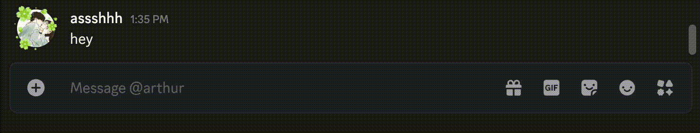

# ByteBot
A Discord self-bot that responds to whitelisted user DMs and message replies using Groq's API. Interactions are logged for tracking purposes. Use at your own risk as self-bots violate Discord’s Terms of Service.

---

# Requirements:
- Python 3.11 or below

---

# Installation Instructions:
Open the terminal application on your computer and paste in the following commands:
1. Clone the repository:
```bash
git clone https://github.com/ChainedTears/ByteBot
```
2. Navigate to the ByteBot directory:
```bash
cd ByteBot
```
3. Install the necessary dependencies:
```bash
pip install -r requirements.txt
```

---

# Usage:
1. Open the ByteBot folder and launch main.py in your preferred text editor
2. Replace ``TOKEN = "REPLACE_HERE"`` with your actual [Discord Token](https://www.androidauthority.com/get-discord-token-3149920/)
3. Replace ``api_key = "API_KEY"`` with your personal API key from the [Groq Console](https://console.groq.com/keys)
4. Add the user IDs of the individuals ByteBot should respond to in the ``WHITELISTED_USER_IDS`` list
5. Run the script:
```bash
python3 main.py
```

---

# Thanks for using ByteBot!

